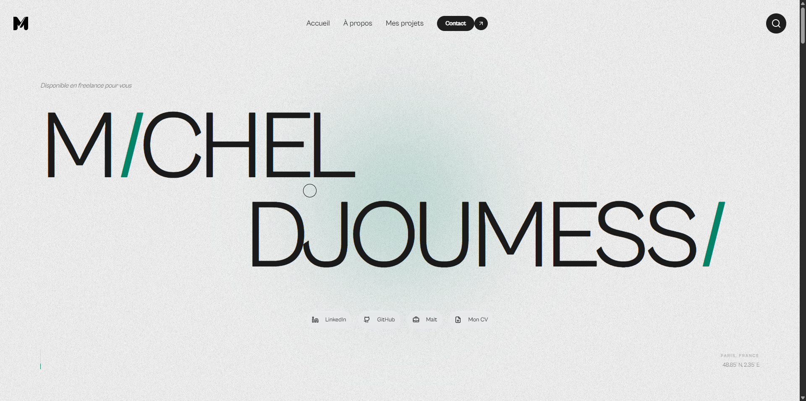

# Michel Djoumessi - Portfolio v3

Portfolio personnel axé sur la performance, le design et l'expérience utilisateur. Cette application permet de présenter mes projets, mon parcours et dispose d'un système d'analytics propriétaire.

## Stack Technique

- Framework : Next.js 16 (App Router)
- Langage : TypeScript
- UI : React 19, Tailwind CSS, Framer Motion, GSAP
- Base de données : Prisma, PostgreSQL
- Tracking : Middleware personnalisé avec filtrage de bots

## Fonctionnalités Clés

- Dashboard Analytics : Visualisation du trafic en temps réel.
- Visit Tracking : Journal des visites avec filtrage local et pagination.
- SEO : Optimisation complète, métadonnées dynamiques et robots.txt.
- Animations : Transitions fluides et scroll interactif (Lenis).

## Installation

Installation des dépendances :

```bash
pnpm install
```

Lancement du serveur de développement :

```bash
pnpm dev
```

Construction pour la production :

```bash
pnpm build
```

Démarrage en production :

```bash
pnpm start
```
